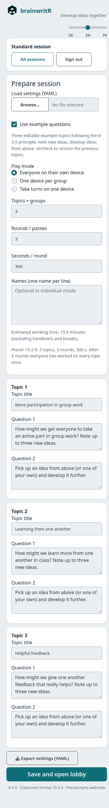
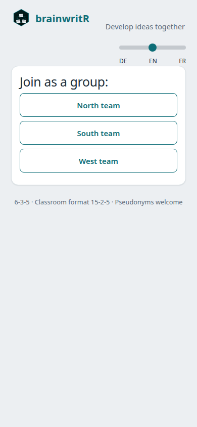
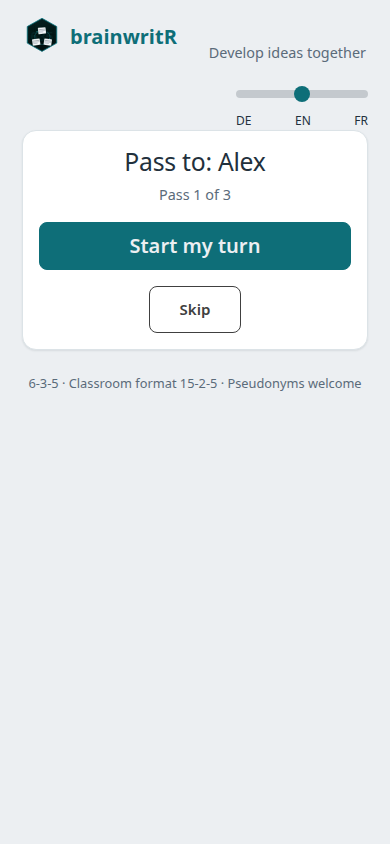
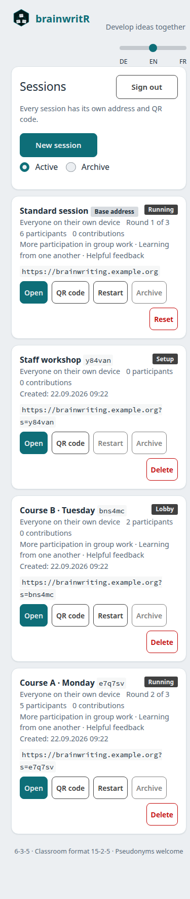
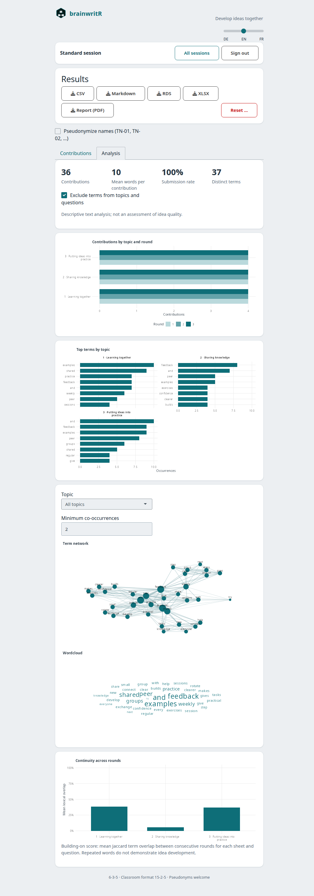

<!-- README.md is generated from README.Rmd. Please edit that file. -->

```{r setup, include=FALSE}
knitr::opts_chunk$set(collapse = TRUE, comment = "#>")
```

# brainwritR 

<!-- badges: start -->
[](https://github.com/CTTIR/brainwritR/actions/workflows/R-CMD-check.yaml)
[](LICENSE.md)
<!-- badges: end -->

**A quiet workspace for building on each other's ideas.**

brainwritR brings a classroom adaptation of Rohrbach's 6-3-5 brainwriting method
onto participants' smartphones. A facilitator sets up topics, invites the room
with a QR code, and runs timed rounds. Participants read earlier contributions
on their assigned sheet, add answers to two questions, and move to the next
topic together. The app offers German, English and French; documentation is English.

The app keeps drafts and the round clock in SQLite, resumes participants after
a mobile reconnect, and avoids replacing textareas during routine polling.
One instance runs any number of sessions side by side, each with its own address
and QR code, managed from a moderator overview.
No accounts, webfonts, or external application services are required.

Use the **DE / EN / FR language slider** to change the interface without replacing
answer fields or translating contributed text. The choice is remembered in that
browser. German is the default. The text-analysis method and export schemas retain
their documented German defaults; the in-app chart labels follow the selected language.

## Install and start

Requires **R 4.4 or newer**. This is a development release, not a CRAN release.

```r
# install.packages("remotes")
remotes::install_github("CTTIR/brainwritR")
brainwritR::run_app()
```

For a local checkout:

```sh
Rscript -e 'install.packages("remotes", repos="https://cloud.r-project.org")'
Rscript -e 'remotes::install_deps(dependencies = TRUE)'
R CMD INSTALL .
Rscript -e 'brainwritR::run_app()'
```

Open `http://localhost:3838` as a participant and
`http://localhost:3838/?mod=1` as moderator. The local default PIN is `635`.
On first launch the app creates `data/brainwriting.sqlite` relative to the
working directory. Nothing is created when the package is merely loaded.

**For a classroom, set the public URL and a private moderator PIN.** A phone's
`localhost` refers to the phone itself; the QR code must point to a reachable
server. Use HTTPS on a public deployment.

```r
brainwritR::run_app(
  base_url = "https://brainwriting.example.de",
  mod_pin = Sys.getenv("MY_CLASSROOM_PIN"),
  db_path = "/srv/brainwriting/data/session.sqlite"
)
```

## Individual-device workflow

1. **Set up:** open the moderator route, enter the PIN, and enter a title and two
   questions for each topic. Choose 2–6 groups, 1–12 rounds, and 30–1800 seconds
   per round. The **15-2-5** preset is three topics, three rounds, five minutes
   per round, designed for roughly 13–17 participants.
2. **Invite:** open the lobby. Participants scan the QR code and enter a name or
   pseudonym. Watch the live roster, then start once at least K people have joined.
3. **Write and rotate:** groups are balanced and randomized. Participants read
   previous rounds on their sheet and answer both questions. Drafts save after
   1.2 seconds of quiet; **Abgeben** explicitly submits both answers. Submitted
   answers remain editable until the round ends. The moderator can add 60 seconds
   or end a round early.
4. **Debrief:** after the last round, the moderator sees results by topic and sheet,
   downloads CSV, Markdown, RDS, XLSX or a two-page PDF, and can reset the session
   (**Zurücksetzen …**) or archive it and start the next one from the session overview.

## Run several sessions

One instance holds any number of sessions, and several can run at the same time,
for example two courses in parallel. The bare address always shows the
**standard session**, exactly as before. Every further session has its own short
code, address and QR code, such as `https://brainwriting.example.de/?s=k7m3pq`.

Open **All sessions** (German: **Alle Sessions**) from the moderator bar, or go to
`/?mod=1&view=sessions`. The overview lists every session with its state, mode,
participant and contribution counts, topics and address, and refreshes as they change.

| Action | Effect |
|:--|:--|
| **New session** | Creates an empty session with an optional label and opens its setup |
| **Open** | Opens the session's moderator view |
| **QR code** | Shows a large QR code with the address; download it as PNG for slides or handouts |
| **Restart** | Creates a new session prefilled with the same mode, topics, timing and names, and opens its setup for review; the original session and its results stay unchanged |
| **Archive / Restore** | Finished sessions only. Archived sessions leave the active list, refuse participants and stay readable with all exports; restoring returns them to the list |
| **Delete** | Permanently removes the session and its database file after confirmation; export first |

The standard session keeps the bare address, so it is never deleted or archived in
place. **Reset** clears it after confirmation. **Archive** saves its finished
results as a new archived session and then clears it for the next activity.

A moderator enters the PIN once per browser tab. The server then issues a login
token that lives only in server memory and in the tab's session storage, so moving
between sessions and reconnecting do not ask for the PIN again. **Abmelden** (sign
out) ends it; a server restart signs everyone out. After five wrong PINs, new logins
pause for 15 seconds, doubling up to five minutes; signed-in moderators continue.
Because the PIN now also protects deletion, use a long private PIN.

Participants keep a separate stored identity for each session, so one device can
join several sessions. Unknown codes show **Session nicht gefunden**; open pages of
a deleted session switch to that notice within a few seconds.

**Storage.** `DB_PATH` holds the standard session and the session catalog. Every
further session is a separate SQLite file with the unchanged schema in a
`sessions/` folder next to it. Back up the whole folder. Existing databases need
no migration: their session simply becomes the standard session.

## Screenshot gallery

Actual browser captures with English selected and English example content.

| Prepare the activity | Individual device |
|:--|:--|
|  |  |

| Shared group device | Hot-seat handover |
|:--|:--|
|  |  |

| Session overview |
|:--|
|  |



## Modi: match the devices in the room

| Device situation | Mode | Author and timing |
|:--|:--|:--|
| Everyone has a phone or laptop | `individual` (default) | One person per author; parallel rounds |
| One device at each group table | `group_device` | One group per author; one sheet per topic; parallel rounds |
| One shared computer for everyone | `hot_seat` | People take sequential timed turns within passes |

Choose the mode during setup; it is frozen once setup is saved. All modes
use the same topic and sheet rotation formulas and preserve submitted flags
through later edits. Existing deployments need no settings file or new arguments.

In **group-device mode**, devices claim a named group. Reclaiming an existing
group asks for confirmation and hands over its existing identity, preserving
all earlier attribution. A stale device can still edit: concurrent writes use
last-write-wins. Close the old tab after taking over. Start normally requires all
K groups; the moderator may choose **Ohne alle Gruppen starten**. Unclaimed
groups can join later. Each topic has exactly one sheet.

In **hot-seat mode**, enter a roster (one name per line). Setup starts directly
at **Weitergeben an: …**, without a QR-code lobby. **Los geht's** starts that
person's timer; **Fertig — weitergeben** saves both answers and advances.
**Überspringen** skips an absent person without creating entries. People are
assigned virtual groups using the same balanced randomization as individual
mode; turns follow roster arrival order. Each pass visits everyone once.

Keep a PIN-authenticated `/?mod=1` tab open on the same machine for **+30 s**,
skipping a turn, ending the rest of a pass, adding latecomers, or finishing early
while retaining results. Latecomers append to the remaining passes. This mode
uses the current turn as identity and does not require browser identity storage.
The duration estimate excludes handovers and pauses: `passes × people × turn_secs`.

With fewer people than topics, empty starting groups receive **one empty sheet**.
This deliberate extension makes the requested one-person hot-seat session usable;
all other starting sheet counts remain frozen. The last-1–2-seconds autosave
boundary applies to hot-seat turns as well as parallel rounds.

## Prepare once, reuse with YAML

For a quick demonstration, select **Use example questions** (German: **Beispiel-Fragenset
verwenden**). Three classroom topics appear in the selected interface language.
They follow the 6-3-5 principle within the two answer fields: each topic is one
open "How might we …?" problem, the first field asks for up to three new ideas,
and the second asks participants to take up an idea already on the sheet (or one
of their own) and develop it further. Edit them freely; clearing the checkbox restores your previous questions and topic
count. Mode, roster and timers stay as configured. Loading a YAML file replaces
the example selection. Changing interface language never translates existing prompts.

The setup form and **Einstellungen laden (YAML)** prepare the same configuration.
Loading a file validates it and prefills the form; it never starts a session.
Review the fields before saving. **Einstellungen exportieren (YAML)** is available
in setup and the lobby. Save it before a hot-seat session starts if you need a
standalone reusable file; the finished RDS snapshot also contains the settings.

```{r settings-example, echo=FALSE, results='asis'}
cat("```yaml\n")
cat(readLines(system.file("extdata", "settings-example.yml", package = "brainwritR")), sep = "\n")
cat("\n```\n")
```

The compatibility identifier remains exactly `brainwriting635-settings/1`.
Topics must contain 2–6 nonempty title/question pairs. Rounds are integers 1–12;
parallel-round duration is 30–1800 seconds and turn duration 20–600 seconds
(default 90). Optional group names must be unique and match the number of topics.
Roster names must be nonempty and unique after trimming. Hot-seat start requires
at least one name. Individual-mode roster names appear as one-tap join buttons;
taken names are disabled, and the free-text join field remains available.

The upload limit is 100 KiB. YAML expressions are never evaluated. All validation
errors appear together in the selected interface language; unknown keys produce warnings and are ignored.
The PIN is never read from or exported to settings. Keep it in runtime configuration.

Database initialization migrates older sessions in place. It adds `mode`
(default `individual`), `current_turn` (default 0), and `settings_yaml` without
changing the other tables or removing data. The additional settings column is a
deliberate extension to keep custom names, the prepared roster, and turn duration
in SQLite across restarts. No sidecar file is required. Back up before upgrading;
an older package version should not be used to operate a newer-mode database.

## Analytics and reports

The moderator's finished screen has **Beiträge** and **Auswertung** tabs. Four
indicators summarize nonempty saved answers: contribution count, average raw word
count, submitted share, and distinct filtered terms. Drafts count as contributions;
**Abgabequote** is submitted nonempty entries divided by all nonempty entries,
not a measure of attendance or the proportion of possible answers completed.

The figures show contributions by topic/round, the top eight terms per topic,
a term network, a wordcloud, and adjacent-round lexical overlap. Network and
wordcloud share a topic selector. The network defaults to at least two entries
containing a pair and at most 40 frequent terms; the cloud uses at most 60 terms.
Layouts use fixed seeds. The same plotting functions create app and report figures.
Empty or insufficient input produces a labelled placeholder instead of an error.

Text processing is deliberately simple: Unicode letter boundaries, German
lowercasing, at least three letters, German Snowball stopwords, no stemming and
no embeddings. Terms from each topic's title and questions are excluded by
default; the app provides a toggle. Term counts retain repeated occurrences.
Network edges count entries containing both terms, once per entry.

**Anknüpfungsgrad** is the mean Jaccard overlap of token sets from consecutive
rounds on each sheet/question, pooling authors who share that sheet. Missing or
empty rounds contribute NA, not zero; available comparisons are averaged by
topic. This is lexical continuity, **not evidence of idea quality or conceptual
elaboration**. Discuss the original contributions alongside the charts.

On macOS, the CRAN R build may require [XQuartz](https://www.xquartz.org/)
for Cairo graphics. Install it before using PDF reports; see the
[R Cairo device documentation](https://search.r-project.org/R/refmans/grDevices/html/cairo.html).

The PDF always has two A4 portrait pages, including for an empty session:
overview/parameters/KPIs/contributions/top terms, then networks/wordcloud/topic
summary. Up to three topics receive separate networks; larger sessions receive
one combined network. Cairo and patchwork compose the report directly: the
runtime container needs no LaTeX, Pandoc, or R Markdown report toolchain.

| Format | Use | Contents |
|:--|:--|:--|
| CSV | Spreadsheet or statistical import | Existing UTF-8 long contribution table |
| Markdown | Readable classroom protocol | Questions and nonempty answers by topic/sheet |
| RDS | Lossless re-analysis in R | Four raw tables, settings, generation time, package version |
| XLSX | Workbook for review | Beiträge, Teilnehmer, Themen, Kennzahlen; styled headers |
| PDF | Shareable two-page debrief | Session overview and the shared descriptive figures |

**Namen pseudonymisieren (TN-01, TN-02, …)** applies stable arrival-order codes to
all five downloads; groups receive `Gruppe-01`, etc. RDS/XLSX persistent author
IDs and stored roster settings are replaced consistently. In-app views retain
real names. This is author-field pseudonymization: identifying information typed
inside answers, topic titles or questions is not detected or redacted. Review
free text before sharing. The PDF contains aggregate results, not an author list.

## How rotation works

K groups work on K topics in parallel. Group `g` in round `r` receives topic
`((g - 1 + r - 1) %% K) + 1`:

```text
              Round 1    Round 2    Round 3
Group 1       Topic 1    Topic 2    Topic 3
Group 2       Topic 2    Topic 3    Topic 1
Group 3       Topic 3    Topic 1    Topic 2
```

```{r rotation}
brainwritR::topic_for(1:3, round = 2, n_groups = 3)
brainwritR::sheet_for(1:6, n_sheets = 5)
```

A topic starts with one sheet per member of its starting group. That count is
**frozen at session start**. A participant with index `i` receives sheet
`((i - 1) %% n_sheets) + 1`. Six people visiting five sheets share the first sheet;
their separate contributions are both retained. Five people visiting six sheets
leave the sixth sheet untouched that round. Thus every group visits every topic
over K rounds, but unequal groups do **not** guarantee a contribution to every
sheet in every round. Completion of answers is voluntary.

Latecomers join the smallest group with a new within-group index. They use the
same modulo mapping without changing sheet counts. The full K-topic guarantee
applies to participants present for all K rounds, not to someone joining halfway
through. With fewer than K rounds, some topics are not visited; with more than K,
the cycle repeats. This two-question classroom adaptation is not the literal
six-person, three-ideas-per-round protocol; the example questions keep its core,
new ideas plus building on the sheet, within two fields.

## Mobile robustness

- **SQLite is authoritative.** Each operation opens and closes a connection;
  WAL and a 5000 ms busy timeout are enabled. Restarting the process retains
  topics, participants, assignments, drafts, submissions, and the clock.
- **Any connected client drives the clock.** Every poll tries the guarded round
  transition. A moderator disconnection does not stop an active room. With no
  clients connected, advancement resumes on the next connection; missed rounds
  are not silently skipped.
- **Reconnect resumes identity.** The client reloads 1.5 seconds after a Shiny
  disconnect and resends the participant ID it stored in `localStorage` for that session. Reset IDs are
  cleared. Keep the same browser and origin to resume. With storage disabled,
  automatic resume is unavailable; use one tab per participant.
- **Typing stays in place.** Two database polls feed live subregions. Main views
  change only on status, round, or assignment transitions. Debounced edits carry
  the context in which they were typed; later autosaves never clear submission.
- **Usable on phones.** System fonts, Bootstrap 5, a 720 px content limit,
  labelled inputs, touch-sized buttons, zoom support, and a prominent countdown.

**Accepted limits:** keystrokes in the last roughly 1–2 seconds can lose the race
with a round change, as with a paper sheet being taken away. A delayed save may
only become visible on the next sheet render. Edits cannot reach the server
while offline. Use **Abgeben** before the timer expires. Multiple tabs sharing
one participant identity can overwrite each other's edits.

## Configuration

Explicit arguments override environment defaults. ENV is read when `run_app()`
is called, not when the package loads.

| Argument | Environment | Default |
|:--|:--|:--|
| `db_path` | `DB_PATH` | `data/brainwriting.sqlite` |
| `mod_pin` | `MOD_PIN` | `635` |
| `base_url` | `BASE_URL` | `http://localhost:3838` |
| `port` | `PORT` | `3838` |
| `host` | — | `0.0.0.0` |
| `poll_ms` | — | `2500` ms |

**Exactly one R process per data folder.** Parallel courses can share one instance
as separate sessions. Do not use replicas, ShinyProxy, or `docker compose --scale`.
Use local persistent disk; a network filesystem is not a supported SQLite deployment.

## Docker and Traefik

Build from the repository root. The image uses `rocker/r-ver:4.4.2` and runs as
unprivileged UID 10001. A standalone local smoke run needs no Traefik:

```sh
docker build -f docker/Dockerfile -t brainwritr:0.4.0 .
docker volume create brainwritr-data
docker run --rm --name brainwritr -p 3838:3838 \
  -e MOD_PIN=choose-a-private-pin \
  -v brainwritr-data:/app/data brainwritr:0.4.0
```

For an existing Traefik installation with an external `proxy` network:

```sh
mkdir -p docker/data
sudo chown 10001:10001 docker/data
export BW_HOST=brainwriting.example.de
export TRAEFIK_CERTRESOLVER=letsencrypt
export MOD_PIN='choose-a-private-pin'
docker compose -f docker/docker-compose.yml up -d --build
```

Replace the example hostname and certificate resolver. DNS, TLS and the existing
Traefik `websecure` entrypoint must already be configured. `BASE_URL` supplies
the QR-code URL. The bind mount is **docker/data/** relative to the Compose file;
it must be writable by UID 10001. It holds the main database and the `sessions/`
folder. Keep the volume when updating images.
Set `TZ=Europe/Berlin` for local export timestamps (already set in Compose).

## Export and privacy

CSV is a UTF-8 long table with `Thema`, `Bogen`, `Runde`, `Frage`, `Teilnehmer`,
`Beitrag`, `abgegeben`, and `Zeit`. `Zeit` uses SQLite local time; `abgegeben` is
0 or 1. Both drafts and submitted entries are included. Empty saved entries are
included in CSV and omitted from the grouped Markdown protocol. Markdown groups
Thema → Bogen → `R{round} · F{question} · {name}: text`.

Use pseudonyms and avoid personal or sensitive information in contributions.
The app stores names/pseudonyms, an opaque participant ID, joining and editing
times, group assignments, and text on your server. Browser storage holds one participant ID per session and the language preference; a moderator tab also keeps its login token in session storage. It makes no application calls to external services and has
no external usage tracking. The moderator can export all contributions and reset the
session. Participants can read earlier drafts as well as submissions on their
assigned sheet; this is a collaborative activity, not a confidential survey.

This supports data-minimizing, self-hosted use; it is **not a blanket GDPR/DSGVO
compliance guarantee**. The operator defines access, notice, retention and backup
policy. Reset deletes the session's logical records and Delete removes a session's
database file, but neither is secure forensic erasure of SQLite pages, filesystem
snapshots, exports or backups. Archived sessions keep their data until deleted. Protect those
separately. Treat exported user text as untrusted when importing into spreadsheet
software or rendering Markdown; use text-only spreadsheet import and a safe
Markdown renderer.

## Development and quality

```r
devtools::document()
devtools::test()
devtools::check(args = "--as-cran")
lintr::lint_package()
rmarkdown::render("README.Rmd")
pkgdown::build_site()
```

Tests cover rotation, lifecycle, balanced assignment, late arrivals, upserts,
clock advancement, authorization, exports, reset, the session catalog, routing,
overview actions and login throttling. `shinytest2` exercises a phone-sized browser,
PIN rejection, reload/resume, polling stability, a participant-driven round change,
separate identities per session and moderator navigation between sessions. Browser tests skip on CRAN or if Chrome is
unavailable; set `CHROMOTE_CHROME` to a Chromium executable to enable them locally.
CI checks Linux, macOS and Windows, lint, and builds the CTTIR-themed pkgdown site.

See the [classroom and deployment guide](https://cttir.github.io/brainwritR/articles/classroom-guide.html)
for facilitation, persistence and operational details. Report bugs at
[GitHub Issues](https://github.com/CTTIR/brainwritR/issues). MIT licensed.
