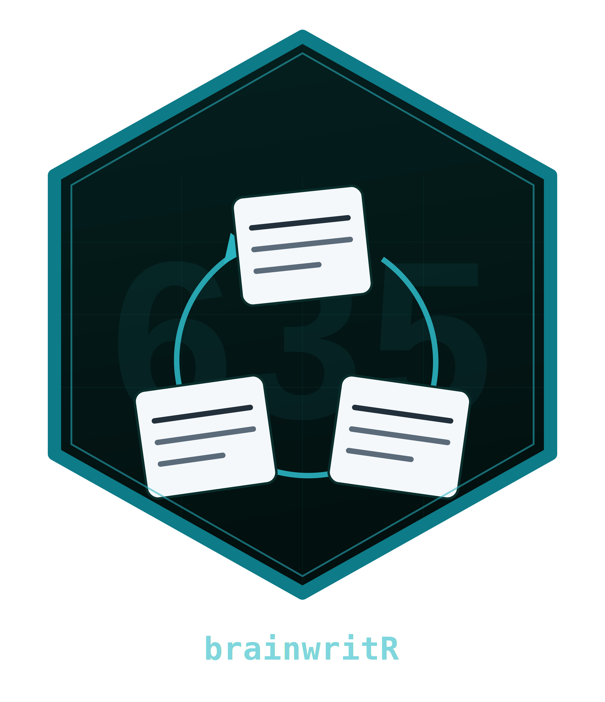
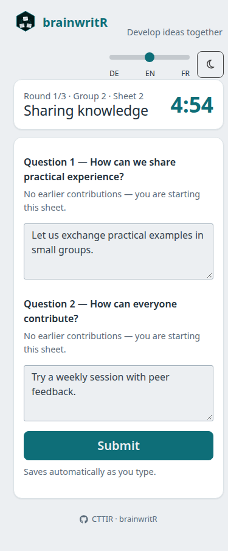

<!-- README.md is generated from README.Rmd. Please edit that file. -->

# brainwritR 

<!-- badges: start -->

[](https://github.com/CTTIR/brainwritR/actions/workflows/R-CMD-check.yaml)
[](LICENSE.md)
<!-- badges: end -->

**A quiet workspace for building on each other’s ideas.**

brainwritR brings a classroom adaptation of Rohrbach’s 6-3-5
brainwriting method onto participants’ smartphones. A facilitator sets
up topics, invites the room with a QR code, and runs timed rounds.
Participants read earlier contributions on their assigned sheet, add
answers to two questions, and move to the next topic together. All
application text is German; documentation is English.

The app keeps drafts and the round clock in SQLite, resumes participants
after a mobile reconnect, and avoids replacing textareas during routine
polling. No accounts, webfonts, or external application services are
required.

## Install and start

Requires **R 4.4 or newer**. This is a development release, not a CRAN
release.

``` r
# install.packages("remotes")
remotes::install_github("CTTIR/brainwritR")
brainwritR::run_app()
```

For a local checkout:

``` sh
Rscript -e 'install.packages("remotes", repos="https://cloud.r-project.org")'
Rscript -e 'remotes::install_deps(dependencies = TRUE)'
R CMD INSTALL .
Rscript -e 'brainwritR::run_app()'
```

Open `http://localhost:3838` as a participant and
`http://localhost:3838/?mod=1` as moderator. The local default PIN is
`635`. On first launch the app creates `data/brainwriting.sqlite`
relative to the working directory. Nothing is created when the package
is merely loaded.

**For a classroom, set the public URL and a private moderator PIN.** A
phone’s `localhost` refers to the phone itself; the QR code must point
to a reachable server. Use HTTPS on a public deployment.

``` r
brainwritR::run_app(
  base_url = "https://brainwriting.example.de",
  mod_pin = Sys.getenv("MY_CLASSROOM_PIN"),
  db_path = "/srv/brainwriting/data/session.sqlite"
)
```

## A session in four steps

1.  **Set up:** open the moderator route, enter the PIN, and enter a
    title and two questions for each topic. Choose 2–6 groups, 1–12
    rounds, and 60–1800 seconds per round. The **15-2-5** preset is
    three topics, three rounds, five minutes per round, designed for
    roughly 13–17 participants.
2.  **Invite:** open the lobby. Participants scan the QR code and enter
    a name or pseudonym. Watch the live roster, then start once at least
    K people have joined.
3.  **Write and rotate:** groups are balanced and randomized.
    Participants read previous rounds on their sheet and answer both
    questions. Drafts save after 1.2 seconds of quiet; **Abgeben**
    explicitly submits both answers. Submitted answers remain editable
    until the round ends. The moderator can add 60 seconds or end a
    round early.
4.  **Debrief:** after the last round, the moderator sees results by
    topic and sheet, downloads CSV or Markdown, and can confirm a full
    session reset.



## How rotation works

K groups work on K topics in parallel. Group `g` in round `r` receives
topic `((g - 1 + r - 1) %% K) + 1`:

``` text
              Round 1    Round 2    Round 3
Group 1       Topic 1    Topic 2    Topic 3
Group 2       Topic 2    Topic 3    Topic 1
Group 3       Topic 3    Topic 1    Topic 2
```

``` r
brainwritR::topic_for(1:3, round = 2, n_groups = 3)
#> [1] 2 3 1
brainwritR::sheet_for(1:6, n_sheets = 5)
#> [1] 1 2 3 4 5 1
```

A topic starts with one sheet per member of its starting group. That
count is **frozen at session start**. A participant with index `i`
receives sheet `((i - 1) %% n_sheets) + 1`. Six people visiting five
sheets share the first sheet; their separate contributions are both
retained. Five people visiting six sheets leave the sixth sheet
untouched that round. Thus every group visits every topic over K rounds,
but unequal groups do **not** guarantee a contribution to every sheet in
every round. Completion of answers is voluntary.

Latecomers join the smallest group with a new within-group index. They
use the same modulo mapping without changing sheet counts. The full
K-topic guarantee applies to participants present for all K rounds, not
to someone joining halfway through. With fewer than K rounds, some
topics are not visited; with more than K, the cycle repeats. This
two-question classroom adaptation is not the literal six-person,
three-ideas-per-round protocol.

## Mobile robustness

- **SQLite is authoritative.** Each operation opens and closes a
  connection; WAL and a 5000 ms busy timeout are enabled. Restarting the
  process retains topics, participants, assignments, drafts,
  submissions, and the clock.
- **Any connected client drives the clock.** Every poll tries the
  guarded round transition. A moderator disconnection does not stop an
  active room. With no clients connected, advancement resumes on the
  next connection; missed rounds are not silently skipped.
- **Reconnect resumes identity.** The client reloads 1.5 seconds after a
  Shiny disconnect and resends its participant ID from `localStorage`.
  Reset IDs are cleared. Keep the same browser and origin to resume.
  With storage disabled, automatic resume is unavailable; use one tab
  per participant.
- **Typing stays in place.** Two database polls feed live subregions.
  Main views change only on status, round, or assignment transitions.
  Debounced edits carry the context in which they were typed; later
  autosaves never clear submission.
- **Usable on phones.** System fonts, Bootstrap 5, a 720 px content
  limit, labelled inputs, touch-sized buttons, zoom support, and a
  prominent countdown.

**Accepted limits:** keystrokes in the last roughly 1–2 seconds can lose
the race with a round change, as with a paper sheet being taken away. A
delayed save may only become visible on the next sheet render. Edits
cannot reach the server while offline. Use **Abgeben** before the timer
expires. Multiple tabs sharing one participant identity can overwrite
each other’s edits.

## Configuration

Explicit arguments override environment defaults. ENV is read when
`run_app()` is called, not when the package loads.

| Argument   | Environment | Default                    |
|:-----------|:------------|:---------------------------|
| `db_path`  | `DB_PATH`   | `data/brainwriting.sqlite` |
| `mod_pin`  | `MOD_PIN`   | `635`                      |
| `base_url` | `BASE_URL`  | `http://localhost:3838`    |
| `port`     | `PORT`      | `3838`                     |
| `host`     | —           | `0.0.0.0`                  |
| `poll_ms`  | —           | `2500` ms                  |

**One session and exactly one R process per instance.** Do not use
replicas, ShinyProxy, or `docker compose --scale`. Parallel courses need
separate containers, databases, hostnames, and Traefik router/service
names. Use local persistent disk; a network filesystem is not a
supported SQLite deployment.

## Docker and Traefik

Build from the repository root. The image uses `rocker/r-ver:4.4.2` and
runs as unprivileged UID 10001. A standalone local smoke run needs no
Traefik:

``` sh
docker build -f docker/Dockerfile -t brainwritr:0.1.0 .
docker volume create brainwritr-data
docker run --rm --name brainwritr -p 3838:3838 \
  -e MOD_PIN=choose-a-private-pin \
  -v brainwritr-data:/app/data brainwritr:0.1.0
```

For an existing Traefik installation with an external `proxy` network:

``` sh
mkdir -p docker/data
sudo chown 10001:10001 docker/data
export BW_HOST=brainwriting.example.de
export TRAEFIK_CERTRESOLVER=letsencrypt
export MOD_PIN='choose-a-private-pin'
docker compose -f docker/docker-compose.yml up -d --build
```

Replace the example hostname and certificate resolver. DNS, TLS and the
existing Traefik `websecure` entrypoint must already be configured.
`BASE_URL` supplies the QR-code URL. The bind mount is **docker/data/**
relative to the Compose file; it must be writable by UID 10001. Keep the
database volume when updating images. Set `TZ=Europe/Berlin` for local
export timestamps (already set in Compose).

## Export and privacy

CSV is a UTF-8 long table with `Thema`, `Bogen`, `Runde`, `Frage`,
`Teilnehmer`, `Beitrag`, `abgegeben`, and `Zeit`. `Zeit` uses SQLite
local time; `abgegeben` is 0 or 1. Both drafts and submitted entries are
included. Empty saved entries are included in CSV and omitted from the
grouped Markdown protocol. Markdown groups Thema → Bogen →
`R{round} · F{question} · {name}: text`.

Use pseudonyms and avoid personal or sensitive information in
contributions. The app stores names/pseudonyms, an opaque participant
ID, joining and editing times, group assignments, and text on your
server. Browser storage holds only the participant ID. It makes no
application calls to external services and has no built-in analytics.
The moderator can export all contributions and reset the session.
Participants can read earlier drafts as well as submissions on their
assigned sheet; this is a collaborative activity, not a confidential
survey.

This supports data-minimizing, self-hosted use; it is **not a blanket
GDPR/DSGVO compliance guarantee**. The operator defines access, notice,
retention and backup policy. Reset deletes the session’s logical
records, but is not secure forensic erasure of SQLite pages, filesystem
snapshots, exports or backups. Protect those separately. Treat exported
user text as untrusted when importing into spreadsheet software or
rendering Markdown; use text-only spreadsheet import and a safe Markdown
renderer.

## Development and quality

``` r
devtools::document()
devtools::test()
devtools::check(args = "--as-cran")
lintr::lint_package()
rmarkdown::render("README.Rmd")
pkgdown::build_site()
```

Tests cover rotation, lifecycle, balanced assignment, late arrivals,
upserts, clock advancement, authorization, exports and reset.
`shinytest2` exercises a phone-sized browser, PIN rejection,
reload/resume, polling stability, and a participant-driven round change.
Browser tests skip on CRAN or if Chrome is unavailable; set
`CHROMOTE_CHROME` to a Chromium executable to enable them locally. CI
checks Linux, macOS and Windows, lint, and builds the CTTIR-themed
pkgdown site.

See the [classroom and deployment
guide](https://cttir.github.io/brainwritR/articles/classroom-guide.html)
for facilitation, persistence and operational details. Report bugs at
[GitHub Issues](https://github.com/CTTIR/brainwritR/issues). MIT
licensed.
